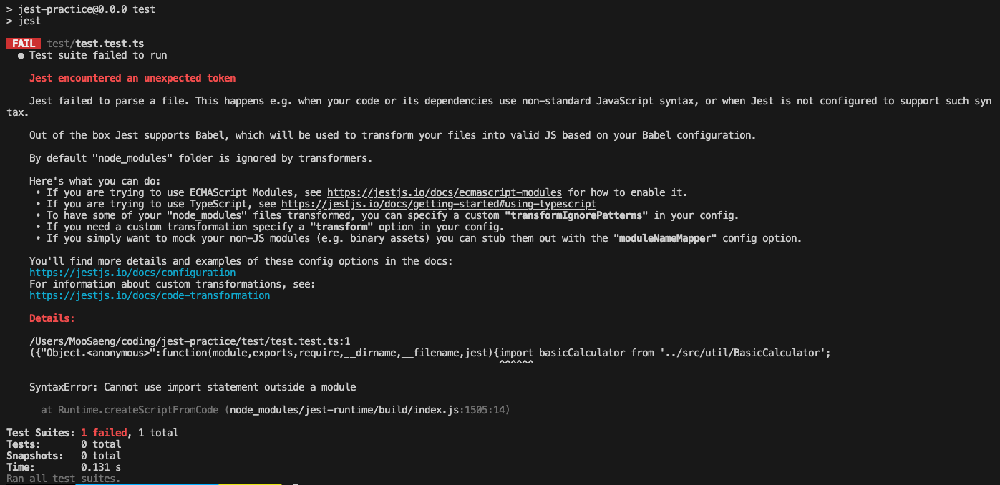
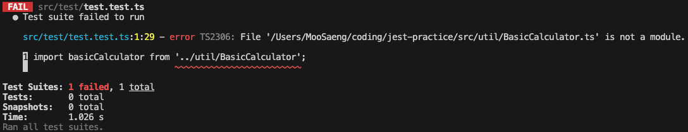
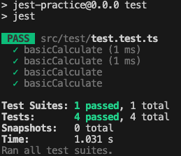

## 테스트 코드 작성 연습

### TDD 방법론 적용

TDD는 Test Driven Development 약자로 테스트 코드를 작성한 후, 실제 코드를 작성하는 방법입니다.

TDD는 크게 red, green, blue의 3가지 단계를 따르는데 각 과정은 아래와 같습니다.

1. Red: 실제 구현을 하기 전에, 먼저 실패하는 테스트 코드를 작성한다. 그 후 테스트를 실행한다. 실제 코드가 작성되지 않았기에 테스트 코드는 당연히 실패한다.
2. Green: 테스트를 통과하기 위해 가장 간단한 형태로 코드를 작성한다. 그 후 테스트를 실행한다. 테스트는 실제 구현이 되었기에 통과한다.
3. Blue: Green 단계의 코드를 더 좋은 형태로 리팩터링한다. 이 과정에서 지속적으로 테스트를 실행해서 테스트가 통과하는지 확인한다.

이런 방식으로 개발을 할 경우에는 아래와 같은 이점이 있습니다.

- 코드 작성 과정에서 확신을 얻을 수 있다.
  - 코드의 동작에 대한 테스트가 작성되어 있고, 실시간 피드백이 가능해지기 때문에 테스트 통과 시 코드가 제대로 작동할 것이란 확신을 가질 수 있습니다.
- 구현을 잘못한 경우 바로 확인 가능하다.
  - 한참 코드를 작성하다 브라우저를 봤는데 외도한 대로 동작이 작동하지 않을 경우, 어느 시점에서 잘못 구현했는지 찾아야하는 번거로움이 있습니다. 하지만 테스트 코드를 작성한 경우(uit test 또는 integration test일 때) 이러한 디버깅 과정이 단축됩니다.
- 코드의 동작이 명확해진다.
  - 어떻게 코드를 짜야할 지가 아니라 무슨 코드를 짜야할 지 부터 고민할 수 있게 됩니다.
  - 즉, 테스트코드를 통해 추상을 구현하고 이를 토대로 구체를 구현하기 때문에 자연스럽게 코드의 동작과 관심사의 분리가 잘 이루어져 객체지향 프로그래밍을 실현할 수 있게 됩니다.

이제 위의 단계에 따라 코드를 작성해보겠습니다.

### 테스트코드 작성

먼저 연습할 프로젝트는 숫자 두 개를 입력하고, 사칙연산 버튼을 클릭하면 해당 연산에 맞는 답을 보여주는 간단한 프로젝트입니다.

여기서 내가 테스트할 함수를 추상화 해보면

```
basicCalcuator: (num1: number, num2: number, operator: string) => number
```

위의 형태일 것입니다.

이에 맞게 테스트 코드를 작성하면

```ts
import basicCalculator from '../src/util/BasicCalculator';

test('basicCalculate', () => {
  expect(basicCalculator(1, 2, '+')).toBe(3);
});

test('basicCalculate', () => {
  expect(basicCalculator(3, 2, '-')).toBe(1);
});

test('basicCalculate', () => {
  expect(basicCalculator(3, 4, '*')).toBe(12);
});

test('basicCalculate', () => {
  expect(basicCalculator(6, 3, '/')).toBe(2);
});
```

위와 같이 테스트를 작성할 수 있겠습니다.

pakage.json에 script를 등록하고

```
  "scripts": {
    "test": "jest"
  },
```

터미널에 npm test를 입력하면



에러가 발생합니다.

jest는 노드 모듈 기반으로 작동하기 때문에 import/export 구문을 쑬 수 없다고 합니다.

따라서 babel을 이용한 변환 작업을 추가적으로 해주어야 합니다.

### vite에서 jest 사용

~~먼저 바벨을 사용하기 위한 core와 바벨 설정을 해주기 위한 preset-env를 설치해주겠습니다.~~

```
npm install -D @babel/core @babel/preset-env
```

~~그리고 공식문서에 나와있는 대로 bable.config.js 파일을 만들어주고 아래와 같이 설정해주겠습니다.~~

```
module.exports = {
  presets: [['@babel/preset-env', {targets: {node: 'current'}}]],
};
```

까지 적용해주면 이제 해결되어야 하지만 저는 vite로 프로젝트를 생성했기 때문에 이렇게 하면 안되는거였습니다.. 설치했던 바벨 패키지는 다시 삭제하고..

vite로 jest를 사용하려면 따로 설정을 해주어야하는데 이 과정에서 꽤 오래 시간을 잡아먹어서 해결 과정은 따로 포스팅하겠습니다..

### red 확인

이제 npm test를 해보겠습니다.



실패했습니다. 당연합니다. 함수가 없으니까요. 이제 green 단계를 위한 함수를 만들어 보겠습니다.

### green 확인

처음 테스트 코드를 작성할 때의 추상을 다시 보겠습니다.

```
basicCalcuator: (num1: number, num2: number, operator: string) => number
```

숫자 두개와 연산자를 받아서 답을 반환하는 함수입니다. green 단계에서는 어떤식으로든 테스트가 성공만 하도록 구현하면 됩니다. 간단하게 만들면 아래와 같습니다.

```ts
export default function basicCalculator(num1: number, num2: number, operator: string) {
  if (num1 && num2) {
    if (operator === '+') {
      return num1 + num2;
    }
    if (operator === '-') {
      return num1 - num2;
    }
    if (operator === '*') {
      return num1 * num2;
    }
    if (operator === '/') {
      return num1 / num2;
    }
  }
  return 0;
}
```

이제 다시 테스트를 해보면



깔끔하게 사칙연산이 모두 성공했습니다.

여기서 좀 더 엄격하게 검사하고 싶다면 테스트를 추가하면 되겠습니다.

이제 기능이 제대로 작동하는 걸 확인했고 이후 과정에서 문제가 발생한다면 이 함수는 절대 원인이 아니라는 확신을 가질 수 있습니다.

### 컴포넌트 구현

마지막으로 해당 함수를 이용하는 페이지 컴포넌트를 만들어 주었습니다.

```ts
const Home = () => {
  const [num1, setNum1] = useState(0);
  const [num2, setNum2] = useState(0);
  const [answer, setAnswer] = useState(0);

  const operators = ['+', '-', '*', '/'];

  return (
    <Wrapper>
      <input defaultValue={0} onChange={(e) => setNum1(Number(e.target.value))} />
      <input defaultValue={0} onChange={(e) => setNum2(Number(e.target.value))} />
      {operators.map((operator, idx) => (
        <Wrapper key={idx}>
          <button onClick={() => setAnswer(basicCalculator(num1, num2, operator))}>
            {operator}
          </button>
        </Wrapper>
      ))}
      <Answer>{answer}</Answer>
    </Wrapper>
  );
};
```

### 화면 확인


제대로 작동하는 걸 확인할 수 있습니다.

### 후기

간단하게 unit test를 시도해보았습니다. 간단하게 함수 하나의 unit test지만

test 코드를 추상으로 표현한다는 개념을 알게되어서 객체 지향 프로그래밍에 한 발 더 다가간 것 같습니다.

다음에는 RTL의 여러 기능을 활용해서 실제 브라우저의 화면에 나오는 요소를 테스트해보겠습니다.
